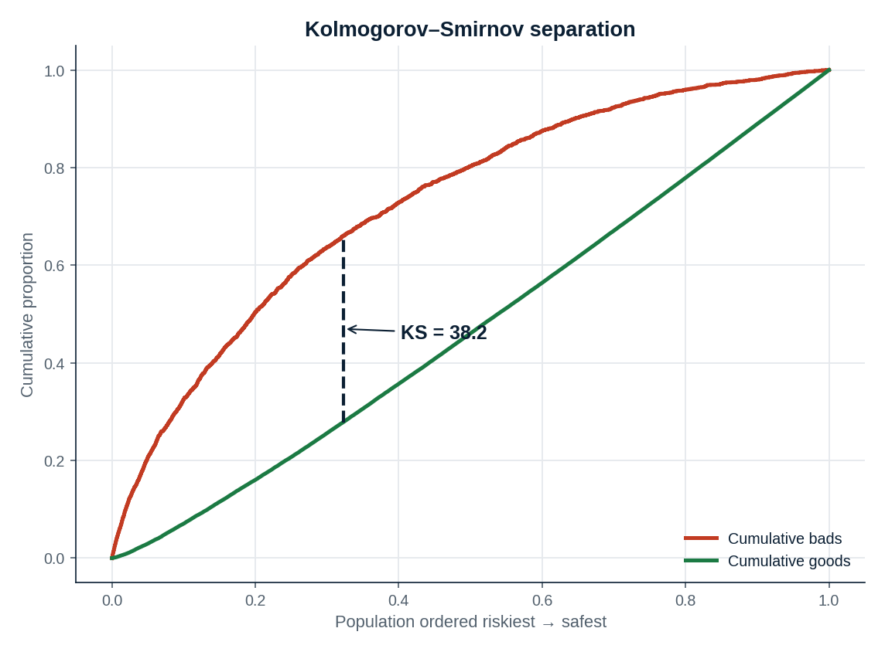
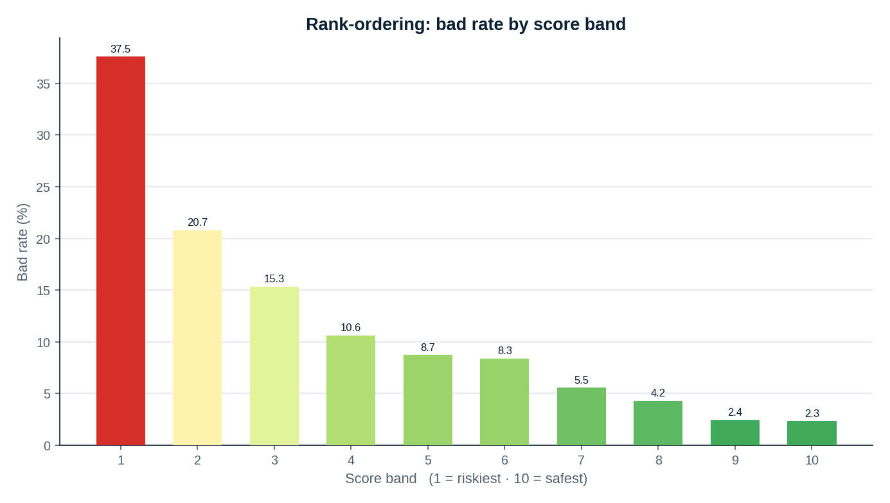
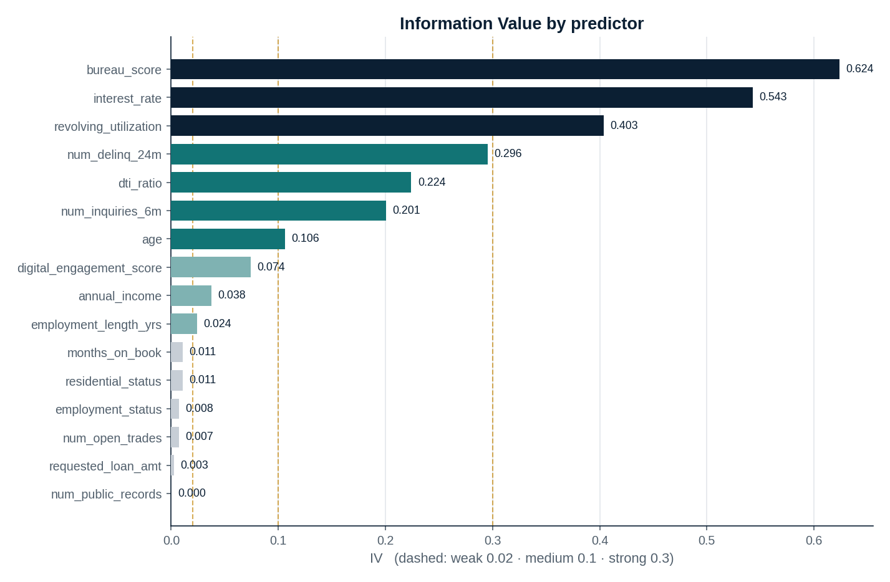
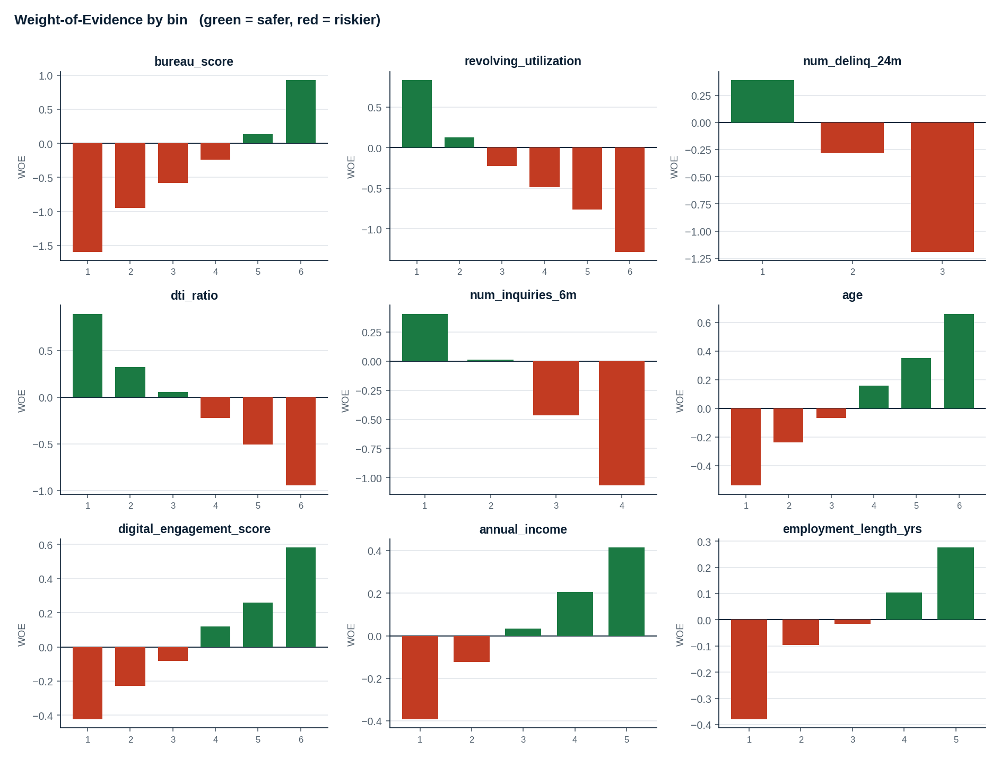
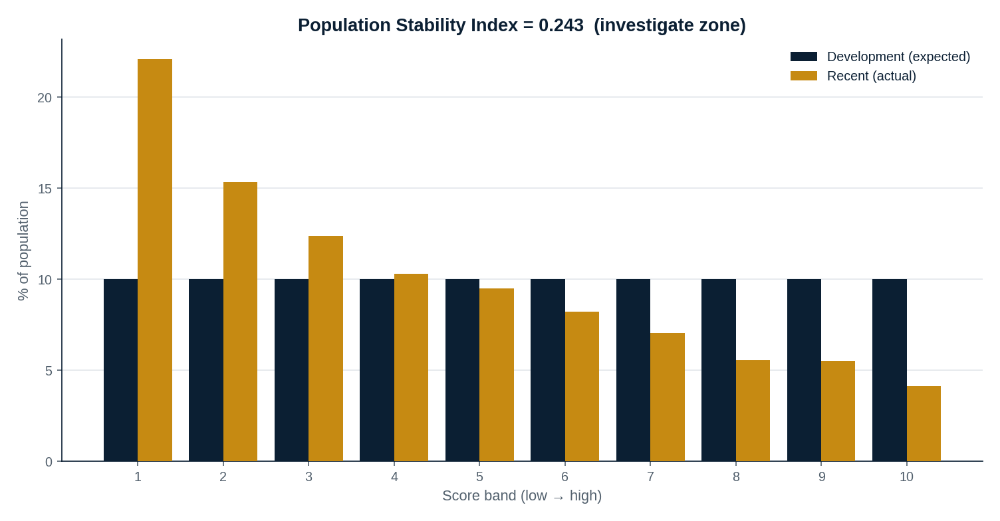
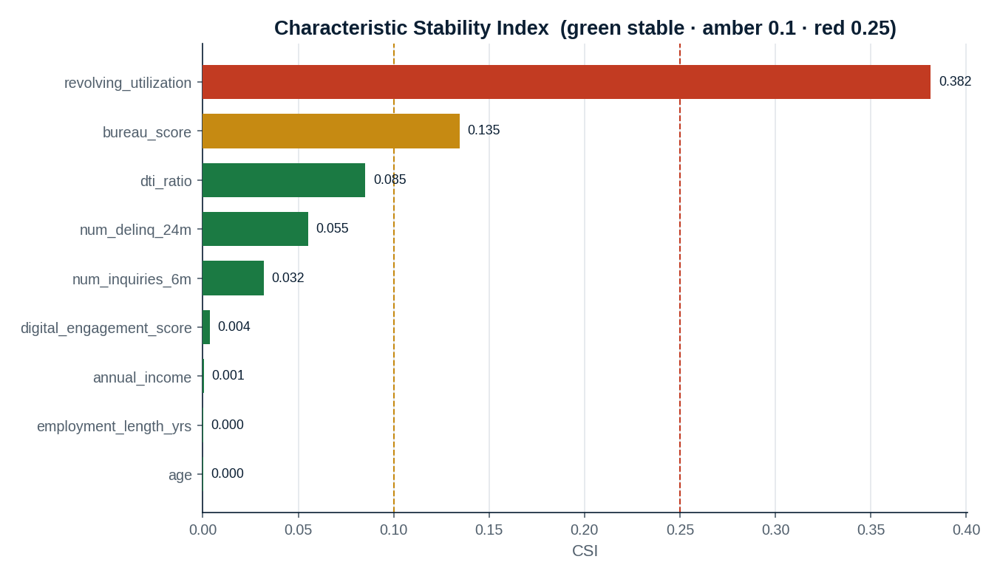
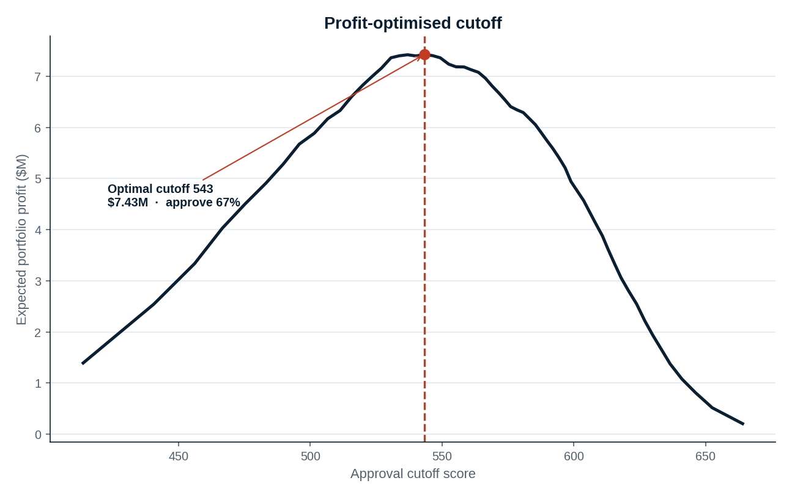
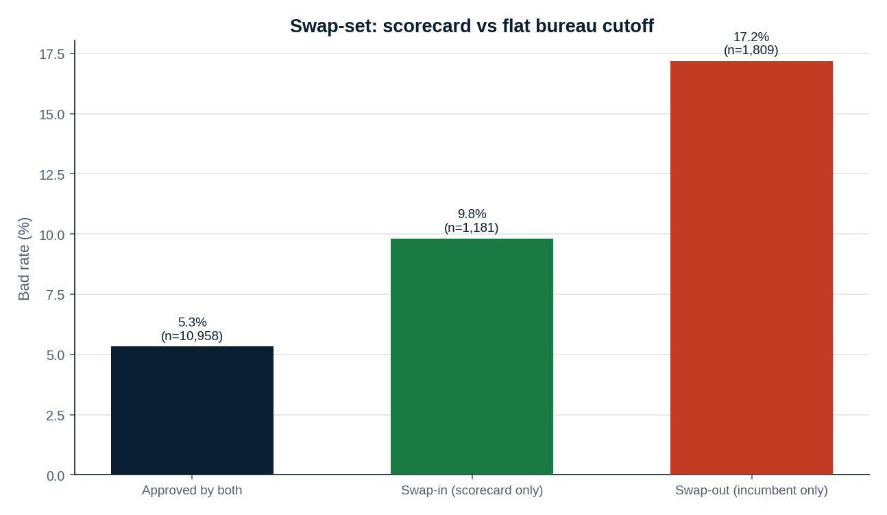

# Probability-of-Default Credit Scorecard — End-to-End Model Development

> A regulator-grade consumer-credit **application scorecard**, built from raw bureau, transactional
> and alternative data all the way through to the **lending strategy and P&L** it drives — with
> champion–challenger benchmarking and live **PSI / CSI** model monitoring under **SR 11-7**.

<p align="center">
  
  
</p>

| Metric | Logistic Scorecard (champion) | XGBoost | Random Forest |
|---|:--:|:--:|:--:|
| **KS statistic** | **38.2** | 39.2 | 39.0 |
| **Gini** | **0.516** | 0.520 | 0.521 |
| **AUC-ROC** | **0.758** | 0.760 | 0.761 |
| Brier (calibration) | **0.090** | 0.190 | 0.179 |

The interpretable champion captures **~99% of the discriminatory power** of the black-box
challengers while remaining far better calibrated and fully explainable — the decision an
experienced model owner makes for a regulated lending product.

📄 **[Open the full visual case-study report →](outputs/Credit_Risk_Scorecard_Report.html)**
*(download the HTML and open in any browser — it's a single self-contained file)*

---

## Why this project

This repository is a portfolio piece demonstrating the **complete lifecycle a credit-risk model
development lead owns** — not just fitting a classifier:

- **Target design & leakage control** — 90+ DPD bad definition over a 12-month performance window; an
  endogenous, high-IV variable (offered interest rate) is *deliberately excluded* because it's priced
  off the very risk being predicted.
- **Weight-of-Evidence / Information-Value engineering** — supervised, monotonic binning; the backbone
  of explainable scorecards.
- **Scaled logistic scorecard** — points system with PDO / base-odds anchors, mapping cleanly to
  adverse-action reason codes.
- **Champion–challenger** — XGBoost and Random Forest benchmark the cost of interpretability.
- **Validation** — KS, Gini/AUC, rank-ordering and calibration, in-time **and** out-of-time.
- **Monitoring** — Population Stability Index (PSI) and Characteristic Stability Index (CSI), with a
  worked recalibrate-vs-rebuild decision.
- **Business translation** — growth–risk frontier, profit-optimised cut-off, and a swap-set against an
  incumbent policy.
- **Governance** — designed against SR 11-7 model risk management and fair-lending expectations.

> ⚠️ **All data is synthetic** — generated by [`src/data_generation.py`](src/data_generation.py) and
> engineered to reproduce realistic risk relationships, bad rates (~11.5% dev) and stability behaviour.
> No real consumer data is used. The methodology transfers directly to production data.

---

## Headline results

### Information Value — what predicts default
<p align="center"></p>

The bureau score dominates, followed by revolving utilisation, recent delinquencies and
debt-to-income — economically exactly what we expect on an unsecured book.

### Weight-of-Evidence profiles (all monotone)
<p align="center"></p>

### Model monitoring — drift detection
<p align="center">
  
  
</p>

The recent (out-of-time) book has a **PSI of 0.24** — in the *investigate* zone — driven by a
deterioration in revolving utilisation (CSI 0.38) and bureau scores. Critically, **discrimination
held** (Gini barely moved) while the bad rate nearly doubled: the model still *ranks* risk correctly
but is *mis-calibrated* to a riskier population, so the correct action is **recalibration, not
rebuild**.

### Business impact
<p align="center">
  
  
</p>

A profit-optimised cut-off approves **67%** of applicants at a **5.8%** bad rate (vs 11.5%
through-the-door) for **$7.4M** of expected profit on the test book. A swap-set against a naïve
bureau-score cut-off shows the scorecard **swaps out 17.2%-bad accounts and swaps in 9.8%-bad ones**.

---

## Repository structure

```
credit-risk-scorecard/
├── README.md
├── requirements.txt
├── src/
│   ├── data_generation.py     # synthetic consumer-credit data with realistic risk structure
│   ├── woe_iv.py              # Weight-of-Evidence / Information-Value engine (monotonic binning)
│   ├── scorecard.py          # feature selection + logistic scorecard + PDO points scaling
│   ├── challengers.py        # XGBoost & Random Forest champion–challenger benchmark
│   ├── validation.py         # KS, Gini/AUC, rank-ordering, calibration, gains
│   ├── monitoring.py         # PSI (score) and CSI (characteristics)
│   ├── business_impact.py    # strategy curve, profit-optimal cut-off, swap-set
│   ├── viz.py                # all charts (consistent institutional styling)
│   ├── run_pipeline.py       # 🚀 end-to-end orchestrator -> figures + results.json
│   └── build_report.py       # assembles the self-contained HTML report
├── outputs/
│   ├── Credit_Risk_Scorecard_Report.html   # the shareable case-study report
│   ├── results.json                         # every metric, machine-readable
│   └── figures/                             # all generated charts (PNG)
├── docs/
│   └── MODEL_DOCUMENTATION.md  # SR 11-7-style model documentation
└── notebooks/
    └── walkthrough.ipynb       # narrative walkthrough of the pipeline
```

---

## Run it yourself

```bash
# 1. clone
git clone https://github.com/<your-username>/credit-risk-scorecard.git
cd credit-risk-scorecard

# 2. install
pip install -r requirements.txt

# 3. run the full pipeline (data -> model -> validation -> monitoring -> business)
python src/run_pipeline.py        # writes outputs/figures/ and outputs/results.json

# 4. (re)build the HTML report
python src/build_report.py        # writes outputs/Credit_Risk_Scorecard_Report.html
```

Each module also runs standalone (e.g. `python src/woe_iv.py`) to print its own diagnostics.

---
## Techniques & stack
**Statistics / ML** — logistic regression, gradient boosting (XGBoost), random forests, Weight of
Evidence, Information Value, Variance Inflation Factors, KS, Gini, AUC-ROC, calibration, PSI, CSI.
**Domain** — application scorecards, bad-rate definition, performance/observation windows, scorecard
scaling (PDO / base odds), reason codes, reject-inference awareness, swap-set analysis.
**Governance** — SR 11-7 model risk management, fair-lending / adverse-action, champion–challenger,
ongoing monitoring thresholds.
**Tools** — Python, pandas, NumPy, scikit-learn, XGBoost, matplotlib
---

*Built as a technical demonstration of credit-risk model development. Synthetic data only.*
